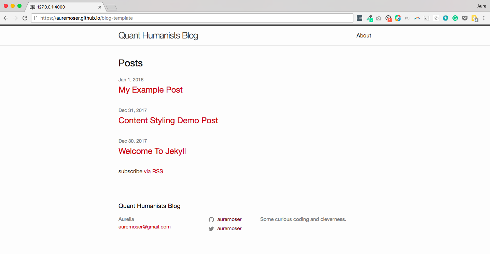

## blog for quant humanists 2018

### select a template

Find a free Jekyll theme online, fork the repo, follow the readme installation instructions and create a blog for this course. Check the license to make sure that forking and modifying is acceptable to the original author.

This was the theme I selected: [Minima](https://jekyll.github.io/minima/) | [Demo](https://jekyll.github.io/minima/)

> Minima has been scaffolded by the `jekyll new-theme` command and therefore has all the necessary files and directories to have a new Jekyll site up and running with zero-configuration.

Here are some resources for selecting a theme:

* [JekyllThemes.io](https://jekyllthemes.io/)
* [JekyllRC](http://themes.jekyllrc.org/)

### setup

After forking, I changed the name of the repository in Github to blog-template, cloned the repo to my local machine. 

To run the blog locally, I had to check my ruby version, install "bundler", read through the [readme installation instructions](https://github.com/jekyll/minima#installation) for minima, delete "gemspec" from my gem file and remove an "seo" tag from the `head.html`; all prescribed in my terminal when trying to run `bundle exec jekyll serve` for a local. Each blog will be different and will probably require different modifications on your machine.

For basic stylistic changes (colors, fonts), you can edit the _sass/minima.scss file while running locally.

When ready, you can enable "gh-pages" by navigating from your Github repo to Settings/GitHub Pages and selecting to "publish" from the master branch. It will populate in your url at this address: <https://YOUR_USERNAME.github.io/YOUR_REPONAME/>.

## License

The theme is available as open source under the terms of the [MIT License](http://opensource.org/licenses/MIT).
